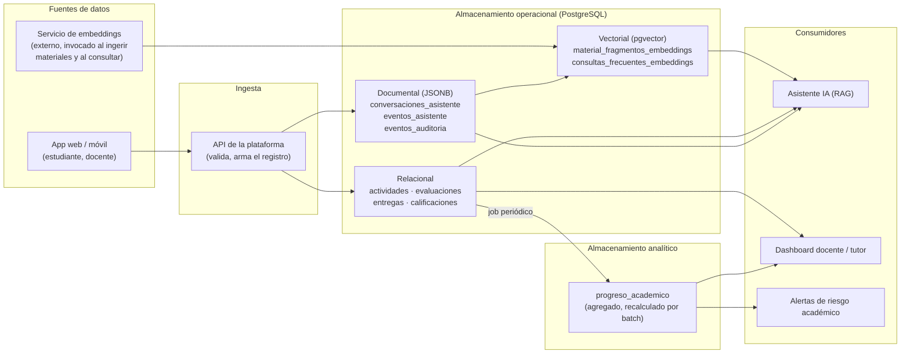

# Arquitectura de datos, escalabilidad y concurrencia (subdominio evaluación y asistente)

> Issue [#15](https://github.com/mairadanielaferrari/plataforma-educativa-asistencia-inteligente/issues/15).
> Depende de #5 (integración del modelo conceptual, pendiente — Maira) y #7 (cerrada). Cubre la
> arquitectura y el análisis de escalabilidad **del subdominio evaluación + asistente**; la
> arquitectura general de la plataforma (incluyendo gestión académica y materiales de estudio)
> se consolida en la issue #5 tomando esta propuesta como una de sus dos partes.

## 1. Arquitectura propuesta (capas)

El caso de uso no justifica un Data Lake ni un Lakehouse: el volumen esperado (una
institución educativa, no miles de millones de eventos) y la necesidad de consistencia
transaccional entre entregas/calificaciones hacen que una **arquitectura en capas sobre un
único motor PostgreSQL multi-modelo** sea suficiente y más simple de operar que separar
componentes physically distintos.

- **Ingesta**: la propia API de la plataforma valida y escribe (no hay ETL externo para datos
  operacionales; sí hay una llamada a un servicio de embeddings al indexar un material nuevo
  o al recibir una consulta, cuyo resultado se guarda en las tablas vectoriales).
- **Almacenamiento operacional**: las tres representaciones ya implementadas (#7, #11, #13)
  conviven en la misma base, lo que permite transacciones que tocan más de una (p. ej.
  registrar una `entrega`/`calificacion` y, si corresponde, una fila en `eventos_auditoria`
  (auditoría, distinta de `eventos_asistente`), en la misma transacción).
- **Almacenamiento analítico**: `progreso_academico` es la única tabla explícitamente
  analítica de este subdominio (agregado precalculado, no se recalcula en cada lectura). No se
  justifica un Data Warehouse separado con el volumen esperado; si el análisis histórico
  creciera mucho (comparar cohortes entre años, por ejemplo), sería el primer candidato a
  moverse a un esquema en estrella separado.
- **Consumidores**: el asistente (RAG) combina las tres representaciones en tiempo de consulta
  (vectorial para recuperar fragmentos relevantes, documental para el historial de la
  conversación, relacional para contexto del estudiante); el dashboard y las alertas leen
  mayormente de la capa analítica.

## 2. Concurrencia

- **Corrección de una entrega**: `UPDATE`/`INSERT` sobre `calificaciones` dentro de una
  transacción que también inserta la fila `cambio_calificacion` en `eventos_auditoria` — si el
  evento de auditoría no se pudo escribir, la calificación tampoco se confirma (todo o nada).
- **Reintentos de entrega concurrentes**: el `UNIQUE (estudiante_id, actividad_id, intento)`
  en `entregas` (issue #7) evita que dos requests simultáneos del mismo estudiante generen el
  mismo número de intento; el intento siguiente se calcula con `SELECT ... FOR UPDATE` sobre
  las entregas previas de esa actividad para evitar una condición de carrera al calcular
  `MAX(intento) + 1`.
- **Recálculo de `progreso_academico`**: se ejecuta como job periódico (no en el camino
  caliente de cada entrega/calificación), con `UPSERT` (`ON CONFLICT` sobre
  `(estudiante_id, curso_id, periodo)`) para que corridas concurrentes o reintentos del job no
  dupliquen filas.

## 3. Escalabilidad y rendimiento

| Pregunta | Análisis |
|---|---|
| ¿Qué crece más? | `entregas`, `conversaciones_asistente` y `eventos_asistente` — crecen con el uso diario de estudiantes, a diferencia de `actividades`/`evaluaciones` que crecen con la oferta académica (mucho más lento). |
| ¿Qué consultas son críticas? | La búsqueda por similitud del asistente (RAG, issue #13) por ser interactiva; el ranking de progreso por curso (issue #9) por ser consultado desde el dashboard docente con frecuencia. |
| ¿Qué índices se necesitan? | Ya creados: B-tree por `estudiante_id`/`curso_id`/`actividad_id` en las tablas operacionales, GIN sobre los JSONB de `conversaciones_asistente`/`eventos_asistente`, HNSW sobre los embeddings (#13). |
| ¿Qué podría particionarse? | `conversaciones_asistente` y `eventos_asistente` por rango de fecha (`fecha_inicio`/`fecha`) si el historial crece mucho — el acceso reciente es el más frecuente, y permite archivar/purgar particiones viejas sin bloquear la tabla activa. |
| ¿Qué podría precalcularse? | `progreso_academico` ya lo está; el ranking de `vw_ranking_estudiantes_curso` (#9) podría pasar de vista a vista materializada si el dashboard la consulta con mucha frecuencia y la latencia del `RANK()` en vivo empezara a pesar. |
| ¿Qué componentes podrían separarse? | El servicio de generación de embeddings (hoy un llamado externo) ya está desacoplado del motor de base de datos; si el volumen de fragmentos vectorizados creciera a millones, `material_fragmentos_embeddings` podría migrar a un servicio vectorial dedicado, manteniendo el resto en PostgreSQL (arquitectura híbrida) — no se justifica hoy con el volumen de una plataforma educativa institucional. |
| Compromisos | Mantener todo en un único PostgreSQL prioriza **simplicidad operativa y consistencia transaccional** por sobre el rendimiento máximo que daría separar componentes; es un compromiso razonable mientras el volumen no exija escalar horizontalmente cada pieza por separado (ver también la justificación tecnológica de la issue #16). |

## 4. Pendiente de integración (issue #5)

- Combinar este diagrama con la arquitectura de gestión académica/materiales de estudio
  (issue #14, Maira) en una única arquitectura general (`docs/arquitectura.png` o equivalente).
- Revisar si el job de recálculo de `progreso_academico` necesita datos de asistencia o
  materiales consultados que viven en el otro subdominio.
