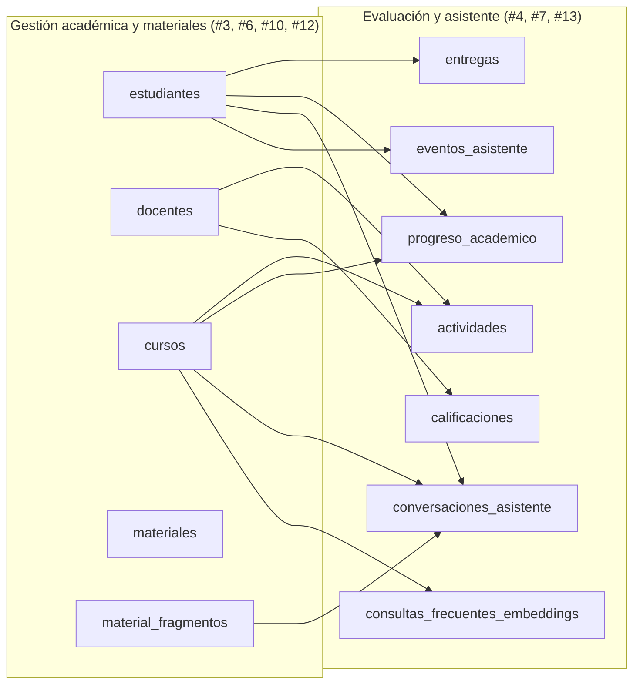

# Integración del modelo conceptual y físico

> Issue [#5](https://github.com/mairadanielaferrari/plataforma-educativa-asistencia-inteligente/issues/5).
> Une las dos partes del diseño: gestión académica y materiales de estudio (parte A, issue #3) con
> evaluación y asistente (parte B, issue #4). Concreta las claves foráneas que ambos modelos
> dejaron pendientes y resuelve el solapamiento de los embeddings de materiales.

## 1. Modelo unificado

Los dos subdominios comparten un núcleo de entidades (estudiante, docente, curso, material) que
gestión académica define (#3, #6) y evaluación/asistente referencia. El detalle está en
[`modelo_conceptual_gestion_materiales.md`](modelo_conceptual_gestion_materiales.md) (parte A) y
[`modelo_conceptual_evaluacion_asistente.md`](modelo_conceptual_evaluacion_asistente.md) (parte B).
Los puntos donde se tocan:



## 2. Claves foráneas agregadas

[`db/integracion/integracion_01_fks.sql`](../db/integracion/integracion_01_fks.sql) agrega las FK
que estaban marcadas como "FK pendiente" en el subdominio de evaluación/asistente:

| Tabla | Columna | Referencia |
|---|---|---|
| `actividades` | `curso_id`, `docente_id` | `cursos`, `docentes` |
| `entregas` | `estudiante_id` | `estudiantes` |
| `calificaciones` | `docente_id` | `docentes` |
| `progreso_academico` | `estudiante_id`, `curso_id` | `estudiantes`, `cursos` |
| `conversaciones_asistente` | `estudiante_id`, `curso_id` | `estudiantes`, `cursos` |
| `eventos_asistente` | `estudiante_id` | `estudiantes` |
| `consultas_frecuentes_embeddings` | `curso_id` | `cursos` |

Se agregan al final (después de estructura y datos) para validar el conjunto completo, y son
idempotentes (se crean solo si no existen).

## 3. Decisión: modelo de embeddings de materiales

Los subdominios modelaron por separado los embeddings de los fragmentos de materiales: el
asistente (#13) con una tabla denormalizada (`material_fragmentos_embeddings`, con `texto`,
`curso_id` y `restringido` embebidos) y materiales (#12) con un modelo normalizado
(`material_fragmentos` + `fragmento_embeddings`, con FK a `materiales`).

**Se adopta el modelo normalizado (#12).** A la escala del caso el JOIN a `materiales` no pesa, y
se evita duplicar y desincronizar el texto y el nivel de acceso (un material restringido no puede
quedar accesible por una fila de embedding vieja). En consecuencia:

- Se elimina la tabla `material_fragmentos_embeddings` y su seed. Los mismos fragmentos y vectores
  ya están en el modelo normalizado (se usaron los mismos ids), así que no hay que re-vectorizar.
- Las consultas de RAG del asistente se repuntaron a `fragmento_embeddings` + `material_fragmentos`
  + `materiales`, derivando el curso y el acceso por JOIN.
- El caché semántico de FAQ (`consultas_frecuentes_embeddings`) es propio del asistente y se
  mantiene.

La justificación del trade-off (normalización vs. denormalización) se desarrolla en la issue #16.

## 4. Orden de aplicación del esquema completo

```
1. db/estructura/*.sql       (tablas de ambos subdominios)
2. db/datos/*.sql            (seeds de ambos subdominios)
3. db/indices_vistas/*.sql   (vistas)
4. db/integracion/*.sql      (FKs cross-subdominio, al final)
```

Verificado contra el Postgres del `docker-compose.yml`: el esquema completo aplica sin errores y
las FK validan los datos de ejemplo de los dos subdominios.
