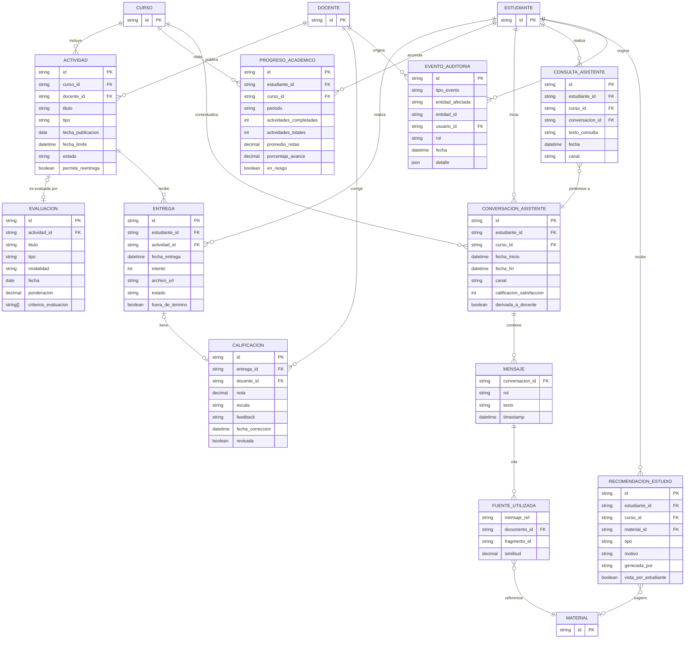

# Modelo conceptual: evaluación y asistente (parte B del ER)

> Issue [#4](https://github.com/mairadanielaferrari/plataforma-educativa-asistencia-inteligente/issues/4).
> Cubre el subdominio de **evaluación** (actividades, entregas, calificaciones, progreso) y
> **asistente** (consultas, conversaciones, fuentes, recomendaciones, auditoría), a partir del
> relevamiento de [`relevamiento_datos.md`](relevamiento_datos.md). Las entidades marcadas como
> *externas* pertenecen al subdominio de gestión académica y materiales de estudio (issue #3,
> Maira) y se integran en la issue #5 — acá se modelan solo como referencias.

## 1. Diagrama entidad-relación (parte B)

## 2. Entidades y atributos relevantes

| Entidad | Atributos principales |
|---|---|
| `Actividad` | id, curso_id, docente_id, titulo, tipo (practico/parcial/foro/cuestionario/proyecto), fecha_publicacion, fecha_limite, estado, permite_reentrega |
| `Evaluacion` | id, actividad_id, titulo, tipo, modalidad, fecha, ponderacion, criterios_evaluacion |
| `Entrega` | id, estudiante_id, actividad_id, fecha_entrega, intento, archivo_url, estado, fuera_de_termino, comentario_estudiante |
| `Calificacion` | id, entrega_id, docente_id, nota, escala, feedback, fecha_correccion, revisada |
| `ProgresoAcademico` | id, estudiante_id, curso_id, periodo, actividades_completadas/totales, promedio_notas, porcentaje_avance, en_riesgo |
| `ConversacionAsistente` | id, estudiante_id, curso_id, fecha_inicio/fin, canal, calificacion_satisfaccion, derivada_a_docente |
| `Mensaje` (débil, embebido en Conversación) | rol (estudiante/asistente), texto, timestamp |
| `FuenteUtilizada` (débil, embebida en Mensaje) | documento_id, fragmento_id, similitud |
| `ConsultaAsistente` *(fuera de alcance / diferida)* | id, estudiante_id, curso_id, conversacion_id, texto_consulta, fecha, canal |
| `RecomendacionEstudio` *(fuera de alcance / diferida)* | id, estudiante_id, curso_id, material_id, tipo, motivo, generada_por, vista_por_estudiante |
| `EventoAuditoria` → tabla `eventos_auditoria` | id, tipo_evento, entidad_afectada, entidad_id, usuario_id, rol, fecha, detalle |

> **Alcance de implementación.** `EventoAuditoria` se implementa en
> [`db/estructura/evaluacion_09_eventos_auditoria.sql`](../db/estructura/evaluacion_09_eventos_auditoria.sql)
> como tabla `eventos_auditoria` (distinta de `eventos_asistente`, que es el log operativo del
> asistente). En cambio `ConsultaAsistente` y `RecomendacionEstudio` quedan **fuera de alcance /
> diferidas**: se modelan a nivel conceptual pero no se crean como tablas en esta entrega (no hay
> consultas que las requieran todavía; ver sección 5 para `ConsultaAsistente`).

## 3. Relaciones y cardinalidades

- **Curso 1:N Actividad** — un curso publica muchas actividades.
- **Docente 1:N Actividad** — un docente publica muchas actividades; una actividad tiene un único docente responsable.
- **Actividad 1:0..1 Evaluación** — no toda actividad es evaluable; una evaluación pertenece a una única actividad.
- **Actividad 1:N Entrega**, **Estudiante 1:N Entrega** — un estudiante puede tener varias entregas (reintentos) por actividad.
- **Entrega 1:0..1 Calificación** — una entrega tiene a lo sumo una calificación vigente.
- **Docente 1:N Calificación** — un docente corrige muchas entregas.
- **Estudiante 1:N ProgresoAcademico**, **Curso 1:N ProgresoAcademico** — un registro de progreso por estudiante, curso y período.
- **Estudiante 1:N ConversacionAsistente**, **Curso 0..1:N ConversacionAsistente** (opcional).
- **ConversacionAsistente 1:N Mensaje** — relación de composición (entidad débil, sin existencia propia).
- **Mensaje 1:N FuenteUtilizada**, **FuenteUtilizada N:1 Material** — solo los mensajes del asistente tienen fuentes.
- **ConsultaAsistente N:1 ConversacionAsistente** — cada consulta individual pertenece a una conversación.
- **Estudiante 1:N RecomendacionEstudio**, **RecomendacionEstudio N:0..1 Material**.
- **EventoAuditoria N:1 Usuario** (Estudiante o Docente, referencia polimórfica) y referencia genérica no tipada (`entidad_afectada` + `entidad_id`) a cualquier otra entidad del subdominio.

## 4. Restricciones del dominio

- La `nota` de una `Calificacion` debe estar dentro del rango de su `escala` (p. ej. 0–10).
- Una `Entrega` fuera de término (`fuera_de_termino = true`) solo es válida si `Actividad.permite_reentrega = true` o existe justificación docente.
- Un docente no puede calificar entregas de actividades que no le pertenecen.
- Toda modificación de `Calificacion` debe generar un `EventoAuditoria` (fila en `eventos_auditoria` con `tipo_evento = cambio_calificacion`), en la misma transacción.
- El asistente solo puede citar como `FuenteUtilizada` materiales a los que el estudiante consultante tiene acceso (riesgo relevado en `relevamiento_datos.md`, resuelto en la arquitectura de seguridad #14/#15).
- Cuando el asistente no puede resolver una consulta con la información disponible, debe marcar `ConversacionAsistente.derivada_a_docente = true` en lugar de generar una respuesta sin fuente.

## 5. Decisión de diseño: `ConsultaAsistente` vs. `ConversacionAsistente`

Se modelan como dos entidades relacionadas y no una sola, de forma deliberada:

- `ConversacionAsistente` es el registro semiestructurado completo (mensajes y fuentes
  embebidos) pensado para el modelo documental JSONB (issue #11) y para reconstruir el
  historial de una interacción.
- `ConsultaAsistente` es una proyección relacional liviana de cada consulta individual,
  pensada para las consultas SQL analíticas del subdominio (issue #9: por ejemplo, "consultas
  por curso" o "temas más consultados") sin tener que parsear JSONB en cada query. Queda
  **fuera de alcance / diferida** en esta entrega: no se crea como tabla porque ninguna consulta
  actual la requiere (las agregaciones se resuelven sobre `conversaciones_asistente` con JSONB).

Esta duplicación controlada se justificará con más detalle (ventajas/costos de mantenerla
sincronizada) en las decisiones de normalización/desnormalización de la issue #16.

## 6. Pendiente de integración (issue #5)

- Definición completa de `Estudiante`, `Docente`, `Curso`, `Material` (atributos, PK) — a
  cargo del modelo conceptual de gestión académica (issue #3).
- Unificación de este diagrama con la parte A en un único ER (`docs/modelo_conceptual.png` o
  `.md` equivalente).
