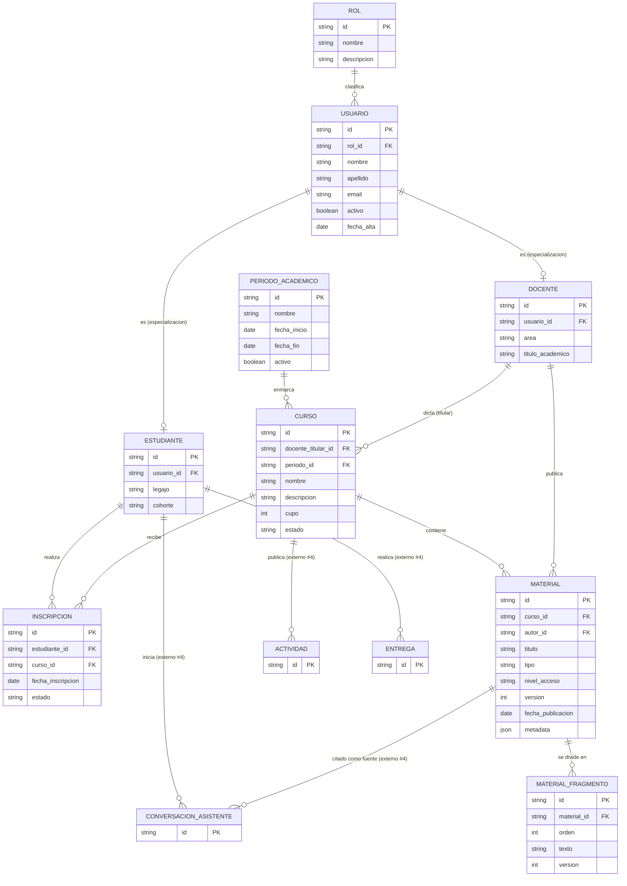

# Modelo conceptual: gestión académica y materiales de estudio (parte A del ER)

> Issue [#3](https://github.com/mairadanielaferrari/plataforma-educativa-asistencia-inteligente/issues/3).
> Cubre el subdominio de **gestión académica** (usuarios, roles, estudiantes, docentes,
> períodos, cursos, inscripciones) y **materiales de estudio** (materiales y sus fragmentos), a
> partir del [análisis del caso de uso](analisis_caso_uso.md) (issue #1). Define las entidades
> que el modelo de evaluación y asistente (issue #4, Sebastián) referencia como *externas*
> (`estudiantes`, `docentes`, `cursos`, `materiales`, `roles`). La unificación de ambas partes en
> un único ER se hace en la issue #5.

## 1. Diagrama entidad-relación (parte A)

Las entidades marcadas como *externas* pertenecen al subdominio de evaluación y asistente y se
muestran solo como referencia (su definición completa está en
[`modelo_conceptual_evaluacion_asistente.md`](modelo_conceptual_evaluacion_asistente.md)).

## 2. Entidades y atributos relevantes

| Entidad | Atributos principales |
|---|---|
| `Rol` | id, nombre (estudiante/docente/tutor/coordinador/administrador), descripcion |
| `Usuario` | id, rol_id, nombre, apellido, email (único), activo, fecha_alta. Identidad y cuenta de acceso de toda persona de la plataforma. |
| `Estudiante` | id, usuario_id (1:1), legajo (único), cohorte. Especialización de `Usuario` con rol estudiante. |
| `Docente` | id, usuario_id (1:1), area, titulo_academico. Especialización de `Usuario` con rol docente. |
| `PeriodoAcademico` | id, nombre (p. ej. `2026-C1`), fecha_inicio, fecha_fin, activo |
| `Curso` | id, docente_titular_id, periodo_id, nombre, descripcion, cupo, estado (planificado/en_curso/finalizado) |
| `Inscripcion` | id, estudiante_id, curso_id, fecha_inscripcion, estado (activa/baja/completada) |
| `Material` | id, curso_id, autor_id (docente), titulo, tipo (apunte/guia_practica/video/normativa/faq), nivel_acceso (publico/curso/restringido), version, fecha_publicacion, metadata (JSONB variable según tipo) |
| `MaterialFragmento` | id, material_id, orden, texto, version. Unidad de contenido (chunk) usada como fuente por el asistente (RAG). |

## 3. Relaciones y cardinalidades

- **Rol 1:N Usuario**: un usuario tiene exactamente un rol; un rol clasifica muchos usuarios.
- **Usuario 1:0..1 Estudiante** y **Usuario 1:0..1 Docente**: especialización (ISA) disjunta:
  un usuario se materializa como estudiante o como docente según su rol; los roles tutor,
  coordinador y administrador no requieren tabla especializada (viven solo en `Usuario`).
- **PeriodoAcademico 1:N Curso**: un curso pertenece a un único período.
- **Docente 1:N Curso**: un docente titular dicta muchos cursos; un curso tiene un titular.
- **Estudiante N:M Curso** resuelta por **`Inscripcion`**: un estudiante se inscribe en muchos
  cursos y un curso tiene muchos estudiantes; la inscripción es única por (estudiante, curso).
- **Curso 1:N Material** y **Docente 1:N Material**: un material pertenece a un curso y lo
  publica un docente.
- **Material 1:N MaterialFragmento**: un material se divide en fragmentos ordenados; el
  fragmento no tiene existencia fuera del material (relación de composición).

## 4. Restricciones del dominio

- `Usuario.email` es único y obligatorio (identifica la cuenta).
- La especialización es coherente con el rol: un `Estudiante` referencia un `Usuario` con
  `rol = estudiante`; un `Docente`, uno con `rol = docente`.
- `Inscripcion` única por (estudiante, curso); un estudiante no puede inscribirse dos veces al
  mismo curso (una reinscripción reactiva el estado, no duplica la fila).
- La cantidad de inscripciones activas de un curso no debería superar su `cupo` (regla de
  negocio a validar en la capa de aplicación o por trigger).
- `Material.nivel_acceso = restringido` implica que solo docentes del curso pueden verlo, y que
  **nunca** puede recuperarse como fuente del asistente para un estudiante (se relaciona con la
  seguridad del RAG, issues #12 y #14).
- Editar un `Material` incrementa su `version`; sus `MaterialFragmento` se revectorizan y
  actualizan `version` para que el asistente no cite contenido obsoleto (ver issue #12).

## 5. Decisiones de diseño

### 5.1 `Usuario` como supertipo con especialización a `Estudiante` / `Docente`

En vez de duplicar nombre, apellido, email y estado en `estudiantes` y `docentes`, se centraliza
la identidad y el acceso en `Usuario` y se dejan en las tablas especializadas solo los atributos
propios de cada rol (legajo/cohorte para estudiante, area/titulo para docente). Ventajas: evita
redundancia y anomalías de actualización (normalización), da un único punto para autenticación y
permisos, y permite que el catálogo de `Rol` sea transversal. Esto también resuelve la
titularidad de la tabla `roles` que en el subdominio de evaluación quedó marcada como "compartida
tras la integración" (`evaluacion_01_roles.sql`): su dueño es este subdominio.

### 5.2 `Material` documental + `MaterialFragmento` como puente al modelo vectorial

`Material` lleva un campo `metadata` **JSONB** porque sus atributos varían según el `tipo` (un
video tiene `duracion`/`url`, una normativa tiene `vigencia`, un apunte tiene `temas`); modelarlo
con columnas fijas obligaría a dejar la mayoría en NULL. El detalle del modelo documental es la
issue #10. `MaterialFragmento` separa el contenido en unidades recuperables: es la entidad que el
modelo vectorial (issue #12) embebe y sobre la que el asistente hace RAG, y la que el subdominio
de evaluación/asistente referencia como `documento_id`/`fragmento_id` al citar una fuente.

## 6. Frontera con evaluación y asistente (integración issue #5)

Este subdominio **provee** las entidades que el de evaluación y asistente referencia como
externas: `estudiantes`, `docentes`, `cursos`, `materiales` y `roles`. En la integración (#5) se
agregan las claves foráneas reales (los `ALTER TABLE ... ADD CONSTRAINT` que el modelo relacional
de evaluación dejó pendientes) y se unifican ambos diagramas en un único ER de la plataforma.
